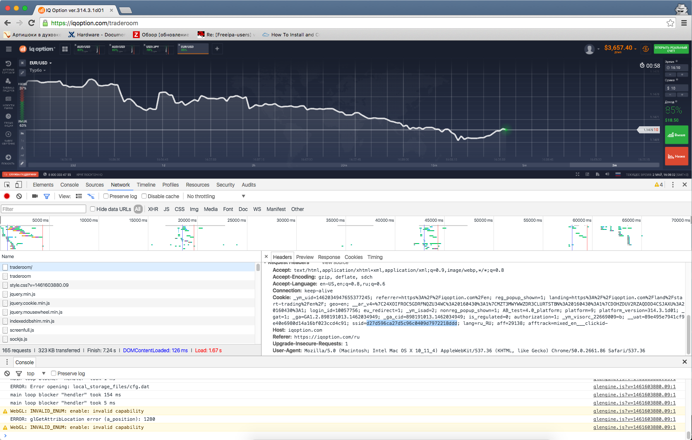

#iq-bot(Python-Websockets)

###Required:
* pip install -r requirements.txt
* Скопировать ssid из Chrome и вставить его в config.yml

###Usage:
python bot.py

####Info:
Логинится, подключается к вебсокетам, подписывается/отписывается на каналы сообщений

